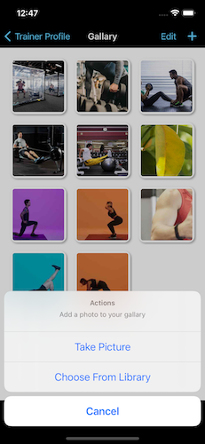
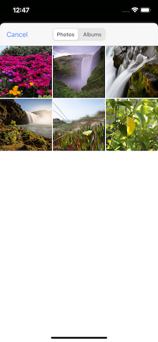

## Introduction

Hi, Humans!

My name is Hamza Farooq and I love 'Swift' programming. I always try to implement new ideas. Do check [Swift-TopViewController](https://github.com/hamza-faroooq/Swift-TopViewController) for this ActionSheetManager to work

# Swift-NativeActionSheetManager
This class is used to make native ActionSheet as per requirements

### Images

## Simple Usage

Do the following simple steps to add this Manager class in your project and present ActionSheets without code redundancy

Simply download or copy [this](https://github.com/hamza-faroooq/Swift-NativeActionSheetManager/blob/main/ActionSheetManager.swift) code and place it in your project. (Click on the link, this will take you to the directory where extension is placed)
